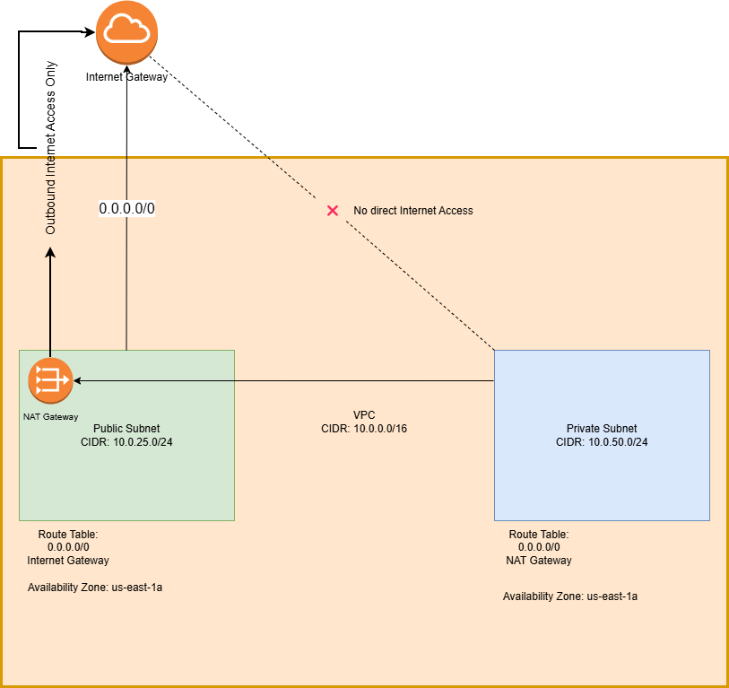
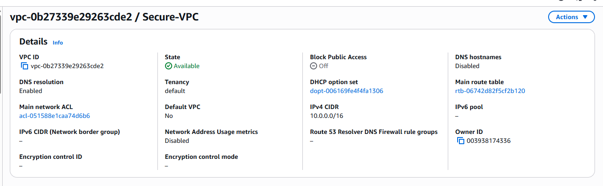
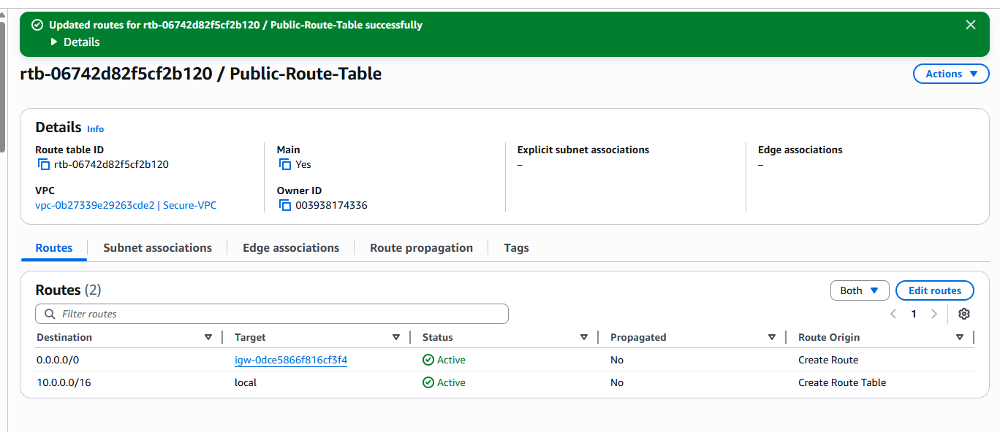
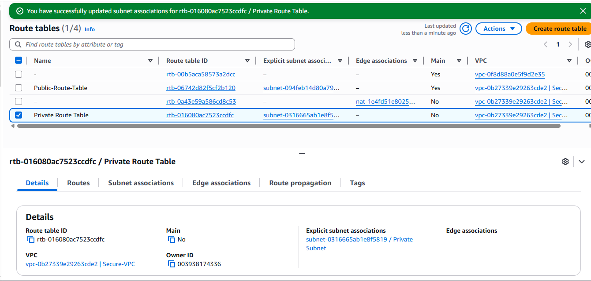
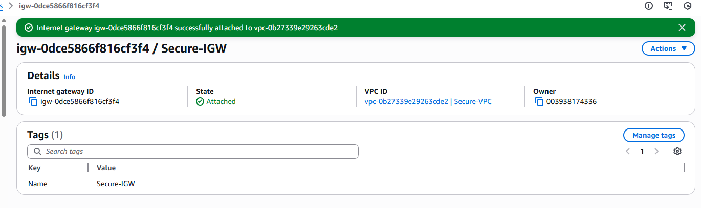
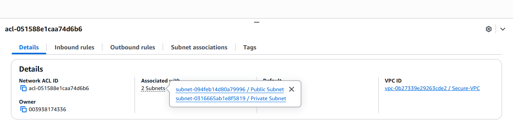
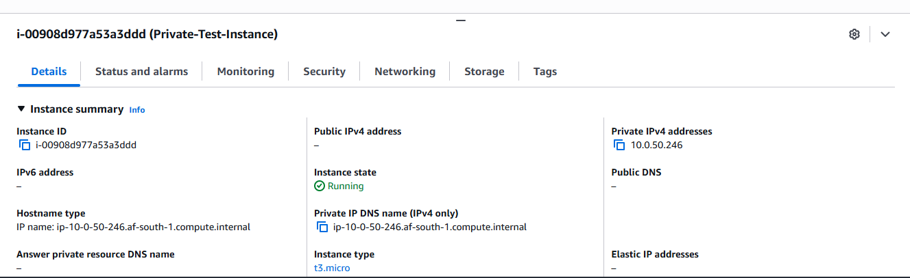

# Secure AWS VPC Infrastructure Deployment

This project focuses on the design and implementation of a secure Amazon Web Services (AWS) Virtual Private Cloud (VPC) using a tiered network architecture. The infrastructure is designed to ensure that resources hosted in a private subnet are able to access the internet securely for outbound traffic (such as software updates) while remaining inaccessible from direct inbound connections originating from the public internet.

The project follows AWS networking best practices by separating public-facing and private resources, implementing controlled routing, and enforcing security boundaries using gateways, route tables, and network access control lists.
## Project Objectives

The objectives of the project are as follows:

* Design and deploy an AWS VPC using the CIDR block 10.0.0.0/16

* Create a public subnet and a private subnet within the same Availability Zone

* Enable internet access for public resources using an Internet Gateway

* Enable secure outbound internet access for private resources using a NAT Gateway

* Prevent direct inbound access to resources hosted in the private subnet

* Apply routing and security controls to support a secure tiered architecture

* Provide documentation and visual proof of the deployed infrastructure
## Architecture Overview

The architecture consists of a single VPC containing two subnets:

* A Public Subnet that allows direct access to the internet

* A Private Subnet that does not allow direct inbound internet access

The public subnet hosts a NAT Gateway, which enables resources in the private subnet to initiate outbound internet connections while maintaining security isolation.

An architecture diagram is provided to visually represent the layout and traffic flow within the VPC.
## 4. Network Configuration Details

### 4.1 VPC Configuration

* VPC CIDR Block: 10.0.0.0/16

* Cloud Provider: Amazon Web Services (AWS)

* Availability Zone: Single Availability Zone

### 4.2 Subnet Configuration

Subnet Type	CIDR Block	Description
| Subnet Type    | CIDR Block   | Description                                              |
| -------------- | ------------ | -------------------------------------------------------- |
| Public Subnet  | 10.0.25.0/24 | Hosts public-facing resources and the NAT Gateway        |
| Private Subnet | 10.0.50.0/24 | Hosts protected resources with no direct internet access |

Both subnets are deployed within the same Availability Zone to meet project requirements.

## 5. Connectivity and Routing

### 5.1 Internet Gateway

An Internet Gateway is attached to the VPC to enable internet connectivity. The public subnet is associated with a route table that directs outbound internet traffic to the Internet Gateway.

### 5.2 NAT Gateway

A NAT Gateway is deployed within the public subnet. This gateway allows resources in the private subnet to access the internet for outbound connections while blocking unsolicited inbound traffic from the public internet.

### 5.3 Route Tables

Separate route tables are configured for each subnet:

#### Public Subnet Route Table

* 0.0.0.0/0 → Internet Gateway

#### Private Subnet Route Table

* 0.0.0.0/0 → NAT Gateway

This routing configuration ensures secure traffic flow and enforces subnet isolation.

## 6. Security Controls
### 6.1 Network Access Control Lists (NACLs)

Network Access Control Lists (NACLs) are applied at the subnet level to control inbound and outbound traffic. The NACL configuration supports the separation between public and private subnets and contributes to the overall security posture of the network.

## 7. Connectivity Testing and Validation

To validate the network configuration, we ensured that resources in both subnets behave as intended:

Private Subnet: Outbound internet access is enabled through the NAT Gateway located in the public subnet. A test EC2 instance deployed in the private subnet has no public IP and no inbound security group rules, ensuring it cannot be accessed directly from the internet. This setup confirms that private resources can initiate outbound connections while remaining protected from direct inbound access.

Public Subnet: Resources in the public subnet have direct internet access via the Internet Gateway, as configured in the public route table.

These validations confirm that the security and connectivity requirements of the project have been met

## 8. Evidence and Screenshots

The following screenshots are included in the /screenshots directory as proof of the deployed infrastructure:

* VPC configuration showing CIDR block

* Public and private subnet route table associations

* NAT Gateway status

Internet Gateway attachment to the VPC

## 9. Conclusion

This project successfully demonstrates the implementation of a secure AWS VPC architecture using industry best practices. By separating public and private resources, controlling routing paths, and enforcing security boundaries, the infrastructure ensures both functionality and protection of sensitive resources within the cloud environment.

## 10. Future Improvements

Future improvements to this project could include:

* Implementing additional security controls, such as security groups and network access control lists (NACLs)

* Adding additional subnets to support a more complex network architecture

* Implementing additional connectivity options, such as VPC peering or VPN

* Implementing additional security controls, such as security groups and network access control lists (NACLs)

* Adding additional subnets to support a more complex network architecture

* Implementing additional connectivity options, such as VPC peering or VPN

## 11. Contact Information

For any questions or concerns, please contact Boipelo on [Github](https://github.com/boipelo-codes)

## 12. Documentation

Here is the documentation for the project:[Secure AWS VPC Infrastructure Deployment](https://capeitinitiative-my.sharepoint.com/:w:/g/personal/boipelo_ngakane_capaciti_org_za/IQCy7muGTtOJTZc0DCw-j7qoAeZ1dr3xc7nN1NyZRl74cEU?e=NJlWVB).

